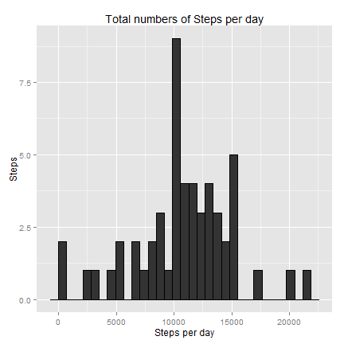
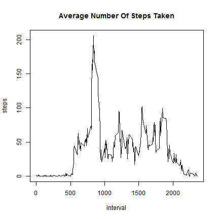
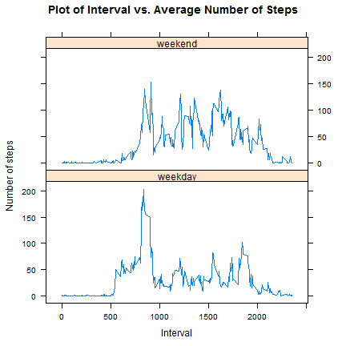

## Load library

```r
require(knitr)
require(dplyr)
require(ggplot2)
require(lattice)

library(knitr)
library(dplyr)
library(ggplot2)
library(lattice)


opts_chunk$set(message=FALSE )
```

## Loading and preprocessing the data

```r
# Load the data.
activity = read.csv(file = "activity.csv", header = TRUE)

# Makes sure date field contains date by transforming string to date format
activity <- transform(activity, date = as.Date(date))
```


## What is mean total number of steps taken per day?

### Part 1. Calculate the total number of steps taken per day

```r
stats <- activity %>% 
    filter(!is.na(steps)) %>%
    group_by(date) %>% 
    summarise(steps = sum(steps))
```


### Part 2. Make a histogram of the total number of steps taken each day

```r
g = ggplot(stats, aes(x=date, y=steps))
g + geom_histogram(stat="identity") + 
    xlab("Dates") + 
    ylab("Steps") +
    labs(title= "Total numbers of Steps per day")
```

 

### Part 3. Calculate and report the mean and median of the total number of steps taken per day


```r
stats <- activity %>% 
    filter(!is.na(steps)) %>%
    group_by(date) %>% 
    summarise(mean = mean(steps), median = median(steps))

head(stats)
```

```
## Source: local data frame [6 x 3]
## 
##         date     mean median
##       (date)    (dbl)  (dbl)
## 1 2012-10-02  0.43750      0
## 2 2012-10-03 39.41667      0
## 3 2012-10-04 42.06944      0
## 4 2012-10-05 46.15972      0
## 5 2012-10-06 53.54167      0
## 6 2012-10-07 38.24653      0
```
## What is the average daily activity pattern?

### Part 1. Make a time series plot 

```r
daily <- activity %>% 
    filter(!is.na(steps)) %>%
    group_by(interval) %>%
    summarize(steps=mean(steps))

plot(daily, main = "Average Number Of Steps Taken", type = "l")
```

 

### Part 2. Which 5-minute interval, on average across all the days in the dataset, contains the maximum number of steps?


```r
daily[which.max(daily$steps), ]$interval
```

```
## [1] 835
```


## Imputing missing values

### Part 1.Calculate and report the total number of missing values in the dataset

```r
sum(is.na(activity))
```

```
## [1] 2304
```


## Part 2. Devise a strategy for filling in all of the missing values in the dataset.The strategy does not need to be sophisticated. 

Since the assignment DOES NOT require a specify strategy but leave leverage to the student, I chose to set the NA value to zero.

## Part 3. Create a new dataset that is equal to the original dataset but with the missing data filled in.

```r
## Clone the original data
cleanData <- activity

## Set the NA values to zero
cleanData$steps[is.na(activity$steps)] <- 0
```

## Part 4. Make a histogram of the total number of steps taken each day


```r
histData <- cleanData %>%
          group_by(date) %>%
          summarize(steps = sum(steps))

g <- ggplot(histData, aes(x=date, y=steps))
g  + geom_histogram(stat="identity") + 
    xlab("Dates") + 
    ylab("Imputed Steps") +
    labs(title= "Total numbers of Steps per day (missing data zeroed)")    
```

 

Calculate and report the mean and median total number of steps taken per day.

```r
    cleanData %>% 
    group_by(date) %>% 
    summarise(mean=mean(steps), median = median(steps)) %>%
    print
```

```
## Source: local data frame [61 x 3]
## 
##          date     mean median
##        (date)    (dbl)  (dbl)
## 1  2012-10-01  0.00000      0
## 2  2012-10-02  0.43750      0
## 3  2012-10-03 39.41667      0
## 4  2012-10-04 42.06944      0
## 5  2012-10-05 46.15972      0
## 6  2012-10-06 53.54167      0
## 7  2012-10-07 38.24653      0
## 8  2012-10-08  0.00000      0
## 9  2012-10-09 44.48264      0
## 10 2012-10-10 34.37500      0
## ..        ...      ...    ...
```

Do these values differ from the estimates from the first part of the assignment?
What is the impact of imputing missing data on the estimates of the total daily number of steps?


To answer this question i calculate the mean and median for all the observations of both dataset (activity, clenData) and compare the results.

```r
mean_of_original_data <- mean(activity$steps, na.rm = T)
mean_of_corrected_data <- mean(cleanData$steps)

mean_of_original_data - mean_of_corrected_data
```

```
## [1] 4.902636
```
The above result is consisten because the mean of the corrected set has
to be smaller given the fact that the corrected dataset (cleanData) contains more entry but all with value zero.


```r
median_of_original_data <- median(activity$steps, na.rm = T)
median_of_corrected_data <- median(cleanData$steps)

median_of_original_data - median_of_corrected_data
```

```
## [1] 0
```
The median is not affected because the correction proposed has introduced
entry with value zero. This is value is equal to the previous value of the median, so that it introduces no changes.


```r
summary(activity[complete.cases(activity),]$steps) - summary(cleanData$steps)
```

```
##    Min. 1st Qu.  Median    Mean 3rd Qu.    Max. 
##     0.0     0.0     0.0     4.9    12.0     0.0
```

## Are there differences in activity patterns between weekdays and weekends?

### Part 1. Create a new factor variable in the dataset with two levels - "weekday" and "weekend" indicating whether a given date is a weekday or weekend day.

I write a function that determines whether the given input date is a weekend.
This function is used inside a sapply call to create a factor column as required.

```r
dayofweek <- function(date) {
    if (weekdays(as.Date(date)) %in% c("Saturday", "Sunday")) {
        "weekend"
    } else {
        "weekday"
    }
}

cleanData$dayType <- as.factor(sapply(cleanData$date, dayofweek))
```


### Part 2. Make a panel plot containing a time series plot.

Make a panel plot containing a time series plot(i.e. type = "l") of the 5-minute interval (x-axis) and the average number of steps taken, averaged across all weekday days or weekend days (y-axis). 


```r
# Calculate the average number of steps broken down by day of weekend (Sat, Sun).
stepsOnWeekend <- cleanData %>%
            filter(dayType == "weekend") %>%
            group_by(interval) %>%
            summarise( mean = mean(steps))

# Calculate the average number of steps broken down by day of every other day (Mom-Fri).
stepsOnWeekday <- cleanData %>%
            filter(dayType == "weekday") %>%
            group_by(interval) %>%
            summarise( mean = mean(steps))

stepsOnWeekend$weekDay <- "weekend"
stepsOnWeekday$weekDay <- "weekday"

# Append the two sets into a unique data frame
weekSteps <- rbind(stepsOnWeekend, stepsOnWeekday)

# Generate the panel plot parted by weekDay
xyplot((mean) ~ interval | weekDay, 
       data = weekSteps, type = "l", 
       main = "Plot of Interval vs. Average Number of Steps", 
       xlab = "Interval",  
       ylab = "Number of steps", layout=c(1,2))
```

 
